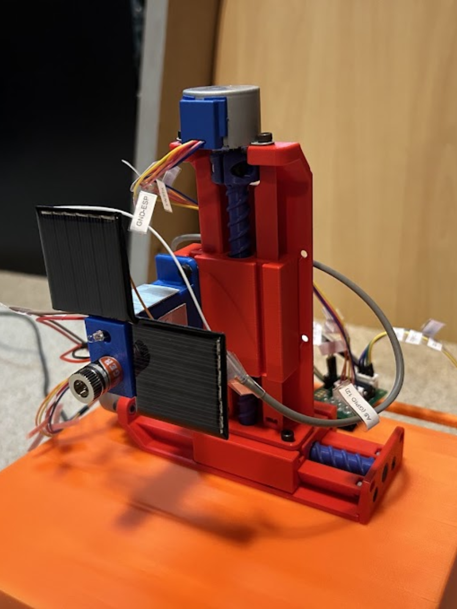
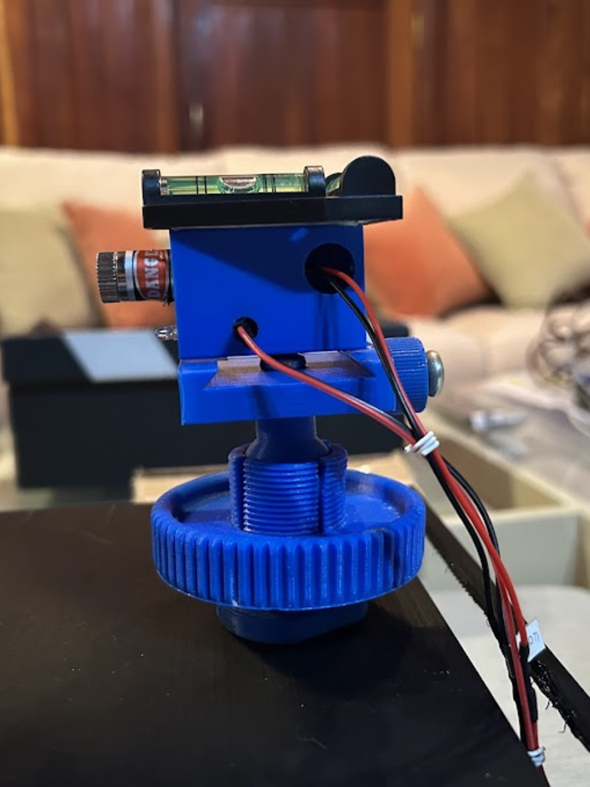

POR  

# 
Comunicação Óptica via Laser 

&nbsp;&nbsp;&nbsp;&nbsp;Este projeto apresenta um sistema de comunicação óptica bidirecional de médio alcance baseado em <strong>FSO — Free Space Optics</strong>, integrando hardware e software para transmitir dados por meio de um feixe de laser.

&nbsp;&nbsp;&nbsp;&nbsp;O sistema utiliza dois microcontroladores <strong>Arduino Nano ESP32</strong>, configurados como pontos de acesso Wi-Fi e responsáveis por hospedar interfaces web. Por meio delas, o usuário pode enviar mensagens de texto e arquivos de imagem, além de visualizar o conteúdo recebido.

&nbsp;&nbsp;&nbsp;&nbsp;A transmissão ocorre pela modulação digital do laser. Os bits <strong>0</strong> e <strong>1</strong> são representados pelos estados desligado e ligado, respectivamente. Os dados são enviados sequencialmente, detectados por um fototransistor e reconstruídos pelo microcontrolador receptor.

&nbsp;&nbsp;&nbsp;&nbsp;O enlace óptico alcançou <strong>37,4 metros sem perda de pacotes</strong>. Nesse limite, a atenuação e a divergência do feixe afetam diretamente a relação sinal-ruído, exigindo alinhamento óptico preciso e um protocolo resiliente para detectar, sincronizar e reconstruir os dados mesmo com o enfraquecimento do sinal.

---

## Imagens do projeto

<table>
  <tr>
    <td align="center" width="50%">
      
    </td>
    <td align="center" width="50%">
      
    </td>
  </tr>
  <tr>
    <td align="center">
      <strong>Figura 1</strong> — Estrutura do módulo MÓVEL do sistema FSO.
    </td>
    <td align="center">
      <strong>Figura 2</strong> — Estrutura do módulo FIXO do sistema FSO.
    </td>
  </tr>
</table>

---

## Escopo deste repositório

&nbsp;&nbsp;&nbsp;&nbsp;Este repositório reúne o sistema integrado do projeto FSO, contemplando a comunicação óptica, a interface web, o controle dos microcontroladores, o alinhamento automático, a leitura dos sensores e o acionamento dos motores. O objetivo é apresentar a integração entre as diferentes etapas necessárias para estabelecer e manter o enlace óptico.

&nbsp;&nbsp;&nbsp;&nbsp;A camada de comunicação de dados foi originalmente projetada e implementada por <strong>Raphael Bassil Costa Geraldine (@Raphael-Geraldine)</strong>. A versão mais recente e específica desse módulo é mantida no repositório dele. Neste projeto, integrei essa implementação ao sistema de alinhamento automático desenvolvido por mim, adequando o funcionamento conjunto entre transmissão, recepção, calibração, movimentação e interface web.

&nbsp;&nbsp;&nbsp;&nbsp;Fui responsável pelo desenvolvimento do alinhamento automático, pela integração entre os módulos de software, pela montagem eletrônica e pela soldagem dos componentes do sistema. Essa etapa envolveu o controle dos motores de passo, a leitura dos sensores ópticos, a calibração da luminosidade ambiente, a busca pelo feixe de laser e o posicionamento preciso do receptor.

&nbsp;&nbsp;&nbsp;&nbsp;A modelagem e a construção mecânica dos módulos ficaram sob responsabilidade de <strong>Guilherme Bassinelli</strong>. Dessa forma, o sistema completo foi desenvolvido de maneira colaborativa, combinando a comunicação implementada por Raphael Geraldine, a estrutura mecânica desenvolvida por Guilherme Bassinelli e o alinhamento automático, a eletrônica, a soldagem e a integração realizados por mim, <strong>Marco Vendramin</strong>.

## Principais destaques técnicos do alinhamento

&nbsp;&nbsp;&nbsp;&nbsp;O sistema de alinhamento automático movimenta o conjunto óptico nos eixos X e Y por meio de dois motores de passo, controlados pelo Arduino Nano ESP32. A posição é representada em coordenadas cartesianas e convertida em deslocamentos físicos considerando as dimensões dos painéis sensores, a quantidade de passos por milímetro e a posição relativa do fototransistor TIL78. 

&nbsp;&nbsp;&nbsp;&nbsp;Antes da busca pelo feixe, o sistema realiza uma calibração automática da iluminação ambiente. As leituras dos sensores são processadas por métodos robustos baseados em mediana e desvio absoluto mediano, permitindo estimar o nível de ruído e definir limiares adaptativos de entrada, saída e intensidade mínima do laser. Dessa forma, o alinhamento permanece funcional mesmo diante de variações de luminosidade.

&nbsp;&nbsp;&nbsp;&nbsp;A localização do enlace combina varreduras em zigue-zague, buscas direcionais e movimentos progressivamente mais precisos. Ao detectar um dos painéis laterais, o algoritmo utiliza a geometria conhecida do módulo para estimar a posição do receptor principal, reduzindo a área de busca. A confirmação final exige múltiplas leituras consecutivas do TIL78, evitando que ruídos ou detecções momentâneas sejam interpretados como alinhamento válido. :contentReference[oaicite:2]{index=2}

&nbsp;&nbsp;&nbsp;&nbsp;As rotinas de calibração, alinhamento e retorno à origem são executadas em tarefas dedicadas do FreeRTOS. Variáveis atômicas e mutexes impedem conflitos entre tarefas e protegem o controle simultâneo dos motores. O processo também pode ser iniciado ou acompanhado pela interface web embarcada, que informa em tempo real os estados de calibração e alinhamento. 

&nbsp;&nbsp;&nbsp;&nbsp;Após a operação, o sistema pode retornar automaticamente ao ponto de origem, cancelando tarefas anteriores, encerrando a comunicação óptica e movimentando os dois eixos de forma controlada. Limites físicos, timeouts de segurança e desligamento das bobinas dos motores reduzem o risco de travamentos, sobrecurso ou aquecimento desnecessário.

## 🎥 Demonstração prática

> Veja o sistema operando e transmitindo dados em uma demonstração curta.

### [▶ Assistir ao vídeo no YouTube](https://www.youtube.com/watch?v=WR5zdiHbGd0)

---

---------------------------------------------------------------------------------------------

ENG   

# 
Laser-Based Optical Communication 

&nbsp;&nbsp;&nbsp;&nbsp;This project presents a medium-range bidirectional optical communication system based on <strong>FSO — Free-Space Optics</strong>, integrating hardware and software to transmit data through a laser beam.

&nbsp;&nbsp;&nbsp;&nbsp;The system uses two <strong>Arduino Nano ESP32</strong> microcontrollers configured as Wi-Fi access points and web interface hosts. Through these interfaces, users can send text messages and image files while viewing the received content.

&nbsp;&nbsp;&nbsp;&nbsp;Transmission is performed through digital modulation of the laser beam. Bits <strong>0</strong> and <strong>1</strong> are represented by the laser's off and on states, respectively. The data is transmitted sequentially, detected by a phototransistor, and reconstructed by the receiving microcontroller.

&nbsp;&nbsp;&nbsp;&nbsp;The optical link reached <strong>37.4 meters with no packet loss</strong>. At this range, beam attenuation and divergence directly affect the signal-to-noise ratio, requiring precise optical alignment and a resilient protocol to detect, synchronize, and reconstruct the data even as the signal weakens.

## Project Images

<table>
  <tr>
    <td align="center" width="50%">
      
    </td>
    <td align="center" width="50%">
      
    </td>
  </tr>
  <tr>
    <td align="center">
      <strong>Figure 1</strong> — Structure of the MOBILE module of the FSO system.
    </td>
    <td align="center">
      <strong>Figure 2</strong> — Structure of the FIXED module of the FSO system.
    </td>
  </tr>
</table>

---

## Repository Scope

&nbsp;&nbsp;&nbsp;&nbsp;This repository contains the integrated FSO project system, including optical communication, the embedded web interface, microcontroller control, automatic alignment, sensor readings, and motor actuation. Its purpose is to present the integration of the different stages required to establish and maintain the optical link.

&nbsp;&nbsp;&nbsp;&nbsp;The data communication layer was originally designed and implemented by <strong>Raphael Bassil Costa Geraldine (@Raphael-Geraldine)</strong>. The latest and dedicated version of that module is maintained in his repository. In this project, I integrated his implementation with the automatic alignment system developed by me, adapting the combined operation of transmission, reception, calibration, movement, and the web interface.

&nbsp;&nbsp;&nbsp;&nbsp;I was responsible for developing the automatic alignment system, integrating the software modules, assembling the electronics, and soldering the system components. This work included stepper-motor control, optical-sensor readings, ambient-light calibration, laser-beam acquisition, and precise receiver positioning.

&nbsp;&nbsp;&nbsp;&nbsp;The mechanical design and construction of the modules were carried out by <strong>Guilherme Bassinelli</strong>. The complete system was therefore developed collaboratively, combining the communication system implemented by Raphael Geraldine, the mechanical structure developed by Guilherme Bassinelli, and the automatic alignment, electronics, soldering, and system integration performed by me, <strong>Marco Vendramin</strong>.

## Automatic Alignment: Key Technical Features

&nbsp;&nbsp;&nbsp;&nbsp;The automatic alignment system moves the optical assembly along the X and Y axes using two stepper motors controlled by an Arduino Nano ESP32. Positions are represented as Cartesian coordinates and converted into physical displacement according to the sensor-panel dimensions, steps per millimeter, and the relative position of the TIL78 phototransistor. 

&nbsp;&nbsp;&nbsp;&nbsp;Before searching for the laser beam, the system automatically calibrates the ambient-light conditions. Sensor readings are processed using robust statistical methods based on the median and median absolute deviation, allowing the firmware to estimate noise and define adaptive thresholds for beam detection, loss, and minimum intensity. 

&nbsp;&nbsp;&nbsp;&nbsp;Beam acquisition combines zigzag scanning, directional searches, and progressively finer movements. When one of the auxiliary sensor panels detects the beam, the algorithm uses the known module geometry to estimate the position of the main receiver and reduce the remaining search area. Final alignment is confirmed through multiple consecutive TIL78 readings, preventing temporary noise from being accepted as a valid link.

&nbsp;&nbsp;&nbsp;&nbsp;Calibration, alignment, and return-to-origin routines run as dedicated FreeRTOS tasks. Atomic flags and mutexes prevent concurrent operations from interfering with motor control. The process can also be started and monitored through the embedded web interface, which displays the current calibration and alignment status. 

&nbsp;&nbsp;&nbsp;&nbsp;After operation, the mechanism can automatically return to its origin while canceling previous tasks and shutting down the optical communication channel. Physical limits, safety timeouts, and motor-coil deactivation help prevent overtravel, task lockups, and unnecessary heating. 

## 🎥 Practical demonstration

> Watch the system operating and transmitting data in a short demonstration.

### [▶ Watch the video on YouTube](https://www.youtube.com/watch?v=WR5zdiHbGd0)

---
